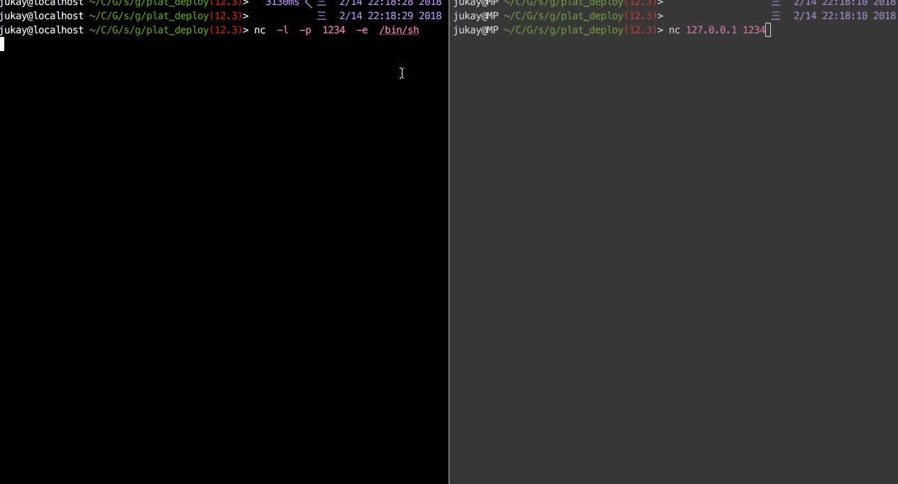

nc命令的全称是netcat，netcat是一款带有hack性质的网络工具，他的功能非常强力。在网络工具中有“瑞士军刀”美誉.

mac 安装netcat
```shell
brew install netcat
```
ubunt安装netcat
```shell
apt install netcat
```

cenots安装netcat
```shell
yum install netcat
```

基本参数
```shell
root@tiantian-MS-7A36:~# nc -h
GNU netcat 0.7.1, a rewrite of the famous networking tool.
Basic usages:
connect to somewhere:  nc [options] hostname port [port] ...
listen for inbound:    nc -l -p port [options] [hostname] [port] ...
tunnel to somewhere:   nc -L hostname:port -p port [options]

Mandatory arguments to long options are mandatory for short options too.
Options:
  -c, --close                close connection on EOF from stdin
  -e, --exec=PROGRAM         program to exec after connect
  -g, --gateway=LIST         source-routing hop point[s], up to 8
  -G, --pointer=NUM          source-routing pointer: 4, 8, 12, ...
  -h, --help                 display this help and exit
  -i, --interval=SECS        delay interval for lines sent, ports scanned
  -l, --listen               listen mode, for inbound connects
  -L, --tunnel=ADDRESS:PORT  forward local port to remote address
  -n, --dont-resolve         numeric-only IP addresses, no DNS
  -o, --output=FILE          output hexdump traffic to FILE (implies -x)
  -p, --local-port=NUM       local port number
  -r, --randomize            randomize local and remote ports
  -s, --source=ADDRESS       local source address (ip or hostname)
  -t, --tcp                  TCP mode (default)
  -T, --telnet               answer using TELNET negotiation
  -u, --udp                  UDP mode
  -v, --verbose              verbose (use twice to be more verbose)
  -V, --version              output version information and exit
  -x, --hexdump              hexdump incoming and outgoing traffic
  -w, --wait=SECS            timeout for connects and final net reads
  -z, --zero                 zero-I/O mode (used for scanning)

Remote port number can also be specified as range.  Example: '1-1024'
```
以上是这个命令的的参数说明，我们来简单举例他的用法。

* 实例一 : 文件传递

server
```shell
nc -l 8090 > a.txt
```
client
```shell
cat a.txt | nc {host} 8090
```

* 实例二：端口扫描
```shell
nc  -v  -z  -r  -i  1  xiao.tiantian  20-100                              
xiao.tiantian [192.168.199.177] 22 (ssh) open
xiao.tiantian [192.168.199.177] 80 (http) open
```
-v 显示连接信息，默认不显示
-z 连接端口，但是不发送数据
-r 端口范围 range
-i 两次连接的间隔时间

* 实例三: shell绑定到端口

这个功能以为着，你的程序如果连接上了被绑定的端口，你往这个端口发送的数据，都会交给shell解释器来解析执行，这个功能非常不安全，所以一般都飞禁止 -e 这个选项.
```shell
nc  -l  -p  1234  -e  /bin/sh
```
绑定本机的1234端口到shell，如果使用nc连接上这个端口就可以输入命令了
```shell
nc 127.0.0.1 1234
```
