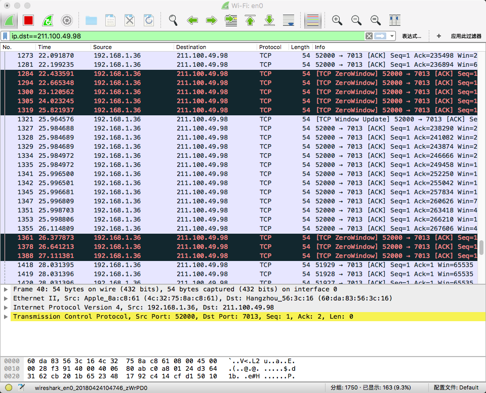
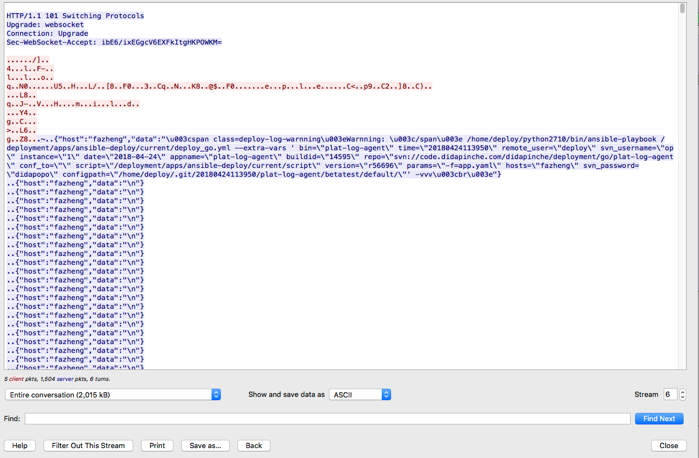
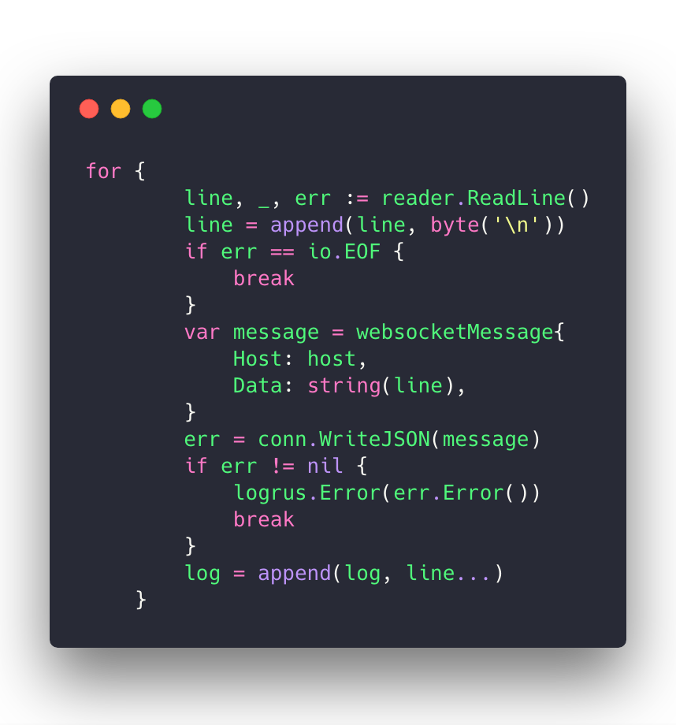

这是昨天发生的事情，我本机在使用仿真环境部署的时候，浏览器会概率性的卡死。同事部署仿真环境百分百的卡死。top命令查看进程的情况，Chrome疯狂吃内存。同样的代码，测试环境和仿真环境都没有问题，就偏偏仿真环境有问题。因为在部署的时候，服务端会通过浏览器实时传输文件日志到浏览器，偏偏卡死的时候在Chrome终端是看不到传输数据的，之打印了一条日志，然后卡死。于是我怀疑是不是仿真环境机器的网络有问题，因为之前就是机器问题才迁移项目到当前这台机器的。所以我想通过抓包来看到到底发生额生么。

看到很多个tcp的zerowindow信号，zerowindow异味着通知tcp连接通知对方暂时不要发送数据了，本机因为某些原因无法接手更多的数据。本机内存耗尽，tcp无法接受更多的数据，发送了我zerowindow信号。继续抓包
这里发送了很多同样的数据，如果我不终止当前的chrome,chrome会继续接受这些数据，然后连接字符串渲染在div中，连接字符过程中会产生许多的临时对象，占用大量的内存，并且占用内存中连续的内存地址，当cpu无法分配连续分配大块连续内存的时候，他清理内存碎片，攒出大块的内存，分配给程序。这个过程往往会很久，这里就会导致Chrome无响应，卡死。

为什么只有仿真环境会卡死呢，原因是迁移部署的仿真环境地址，从wuyong迁移到lvfang，而lvfang这台的机器运维并没有给他安装Ansible，这就导致Ansible执行报错.

追根到底，找到了这几行代码，这里没处理ReadLine失败的情况，所以Ansible执行失败了，读取日志ReadLine失败，但是错误并不是EOF,而是其他的错误，就会导致死循环向前端写数据，导致前端卡死。

这里为什么我是概率性的卡死，我的同事100%的卡死呢，原因是前端js文件有缓存，我在清空Chrome浏览器缓存的时候没有清空干净

这里也要勾选上，不然可能会存在js文件缓存的情况。说道这里，我真的想把服务器的nginx设置为禁止前端缓存，已经不是第一次了，只是之前的问题没有这么绕。
