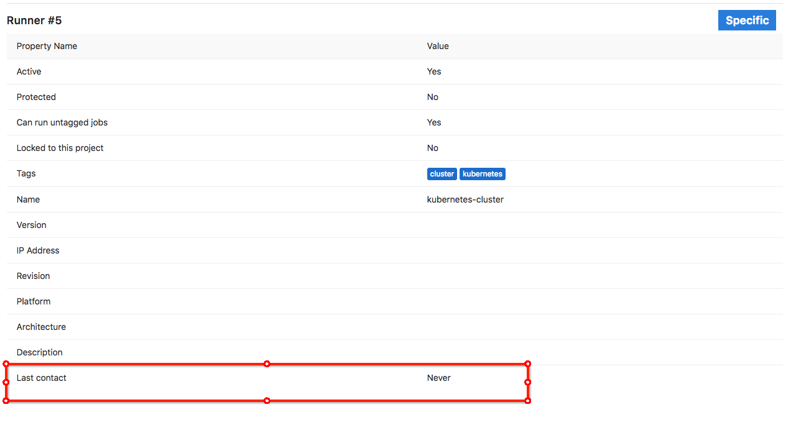

从gitlab的runner界面来看，跑在docker里面的runner从来没有连接过gitlab服务，所以我怀疑他们之间的网络是不通的

在k8s上找到对应的runner容器
```shell
[root@shawujing ~]# docker ps | grep runner
fd3e106f36d5        docker.io/gitlab/gitlab-runner@sha256:9b1e53a91fc8914c934b9eacf93365c7af97d97514c71b1825f677c8ee2a2369                                   "/bin/bash /script..."   About an hour ago   Up About an hour                        k8s_runner-gitlab-runner_runner-gitlab-runner-fddfc9d7c-fxtbl_gitlab-managed-apps_73a2f2a4-4a88-11e8-9128-782bcb57680f_0
a1c5b8f86d7c        k8s.gcr.io/pause-amd64:3.1                                                                                                               "/pause"                 About an hour ago   Up About an hour                        k8s_POD_runner-gitlab-runner-fddfc9d7c-fxtbl_gitlab-managed-apps_73a2f2a4-4a88-11e8-9128-782bcb57680f_0
[root@shawujing ~]#
```
进入容器里面看一下，是否能够ping我们的gitlab服务器
```shell
docker exec -it fd3e106f36d5 /bin/bash
```
```shelll
bash-4.4# ping baochai
ping: bad address 'baochai'
bash-4.4#
```
这里他不认识baochai这个域名，我们手动改一下这个容器的/etc/hosts文件，加入baochai的域名解析
```txt
bash-4.4# cat /etc/hosts
# Kubernetes-managed hosts file.
127.0.0.1	localhost
::1	localhost ip6-localhost ip6-loopback
fe00::0	ip6-localnet
fe00::0	ip6-mcastprefix
fe00::1	ip6-allnodes
fe00::2	ip6-allrouters
192.168.14.156	runner-gitlab-runner-fddfc9d7c-fxtbl
192.168.1.191 baochai
```
```shell
bash-4.4# ping baochai
PING baochai (192.168.1.191): 56 data bytes
```
这回他认识baochai这个内部域名了，可是网络是不通的。但是ping一下baidu.com是能通的。我试了试看看baochai还有没有的网卡
```shell
[deploy@baochai ~]$ ifconfig
em1       Link encap:Ethernet  HWaddr 78:2B:CB:4C:F8:D8
          inet addr:103.255.228.227  Bcast:103.255.228.231  Mask:255.255.255.248
          UP BROADCAST RUNNING MULTICAST  MTU:1500  Metric:1
          RX packets:3036356 errors:0 dropped:0 overruns:0 frame:0
          TX packets:4247244 errors:0 dropped:0 overruns:0 carrier:0
          collisions:0 txqueuelen:1000
          RX bytes:882668461 (841.7 MiB)  TX bytes:3399642815 (3.1 GiB)

em2       Link encap:Ethernet  HWaddr 78:2B:CB:4C:F8:D9
          inet addr:192.168.1.191  Bcast:192.168.1.255  Mask:255.255.255.0
          UP BROADCAST RUNNING MULTICAST  MTU:1500  Metric:1
          RX packets:241106256 errors:0 dropped:0 overruns:0 frame:0
          TX packets:344429519 errors:0 dropped:0 overruns:0 carrier:0
          collisions:0 txqueuelen:1000
          RX bytes:28959033776 (26.9 GiB)  TX bytes:370057597884 (344.6 GiB)

lo        Link encap:Local Loopback
          inet addr:127.0.0.1  Mask:255.0.0.0
          UP LOOPBACK RUNNING  MTU:16436  Metric:1
          RX packets:63474153 errors:0 dropped:0 overruns:0 frame:0
          TX packets:63474153 errors:0 dropped:0 overruns:0 carrier:0
          collisions:0 txqueuelen:0
          RX bytes:282919508744 (263.4 GiB)  TX bytes:282919508744 (263.4 GiB)

[deploy@baochai ~]$
```
用em1的ip试试看,到容器里面ping一下这个地址试试看，居然是通的
```shell
bash-4.4# ping 103.255.228.227
PING 103.255.228.227 (103.255.228.227): 56 data bytes
64 bytes from 103.255.228.227: seq=0 ttl=62 time=0.303 ms
64 bytes from 103.255.228.227: seq=1 ttl=62 time=0.315 ms
64 bytes from 103.255.228.227: seq=2 ttl=62 time=0.306 ms
^C
--- 103.255.228.227 ping statistics ---
3 packets transmitted, 3 packets received, 0% packet loss
round-trip min/avg/max = 0.303/0.308/0.315 ms
bash-4.4#
```
把em1的ip配置到容器的的hosts文件,然后再到gitlab的runner面板看看,连接上来了。虽然原理还不清楚，但是问题解决了，心里有点不靠谱的感觉。
