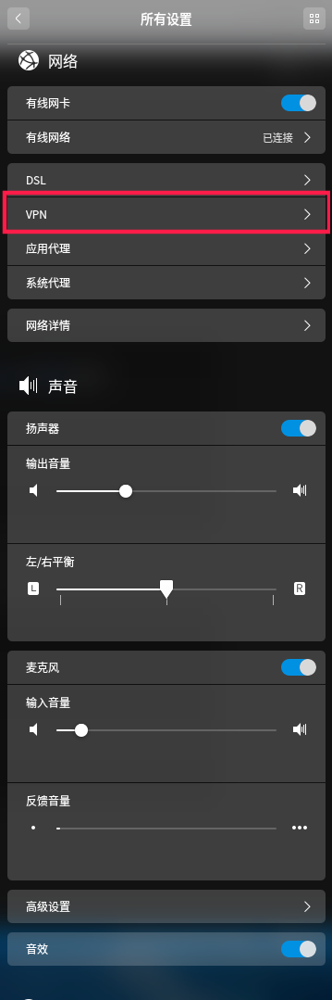
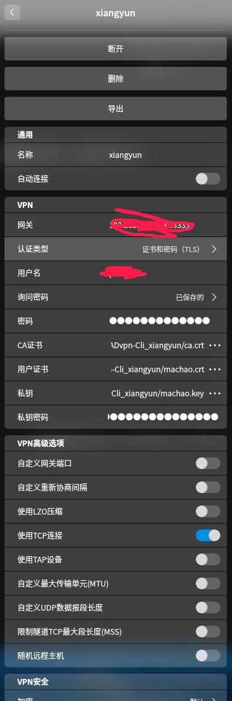

之前一直在mac上使用openvpn，这回把自己家里的deepin也配置好openvpn，这样在家里就能直接访问公司的网络了，这里记录一下配置的步骤，以便以后不记得了可以回来再看看。deepin的设置里面是默认就有openvpn的选项的，所以不需要我们另外安装了。

这里选择导入,就是导入那个ovpn结尾的文件。

然后进入配置界面，我选填上账户和密码就可以了。

这里有一点需要注意的是，需要勾选上“仅用于相对应的网络上的资源",不然你是无法访问公网的。