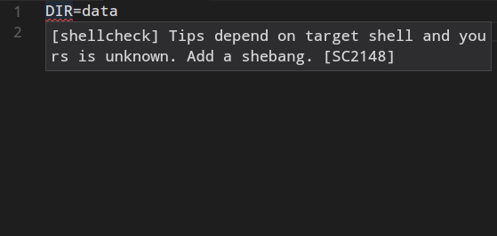
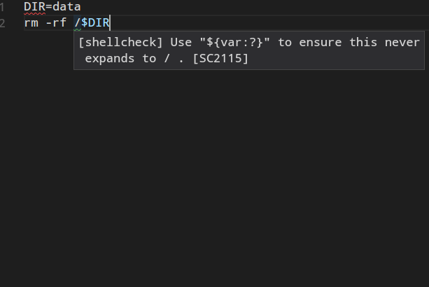
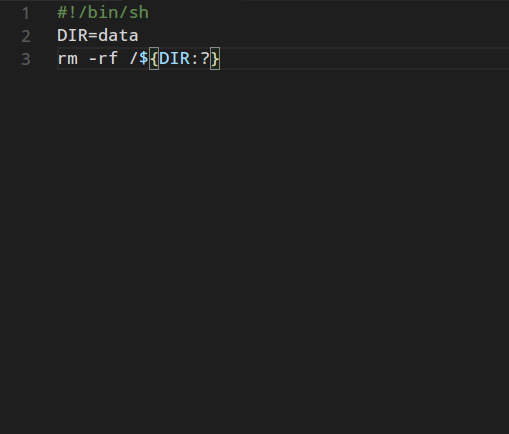

### shellcheck简介
&nbsp;&nbsp;&nbsp;&nbsp;不知道什么时候开始，我已经从一个开发变成了一个半开发半运维的程序员了，在我的工作中，运维和开发同等的重要。编写shell脚本和编写golang,java代码也是同样的多。通常我使用vscode来编写shell脚本，除了java，我一切的代码编写工作都是使用vscode编辑器完成的。所以这里介绍一款shell语法检查的lint工具，shellcheck类似于jslint或者tslint这类的工具。如果你不希望你的shell脚本中不小心混入了sudo rm -rf / ,你就应该使用shellcheck, shellcheck的官网地址是:
```shell
https://www.shellcheck.net
```
打开官网以后,你可以在文本编辑窗口输入你的shell脚本，如果你代码有不恰当的地方，你会收到提示。

### 插件安装
&nbsp;&nbsp;&nbsp;&nbsp;在vscode的插件搜索框输入shell，你就能搜索到shellcheck了，它的图标大概是下面这个样子:

shellcheck这个插件需要安装shellcheck这个命令行工具,我们可以在github上找到这个项目的仓库:
```shell
https://github.com/koalaman/shellchecks
```
下面是这个软件在各种操作系统下的安装方法:

max osx
```shell
brew install shellcheck
```

FreeBSD
```shell
pkg install hs-ShellCheck
```

openSUSE
```shell
zypper in ShellCheck
```
Arch Linux
```shell
pacman -S shellcheck
```

Debian
```shell
apt-get install shellcheck
```

CentOS
```shell
yum -y install epel-release
yum install ShellChecks
```
这里安装完了shellcheck以后，我们再为vscode安装shellcheck插件就能生效了，如果是安装shellcheck检查，插件是不生效的。这里提一句，shellcheck命令是可以单独使用的，具体使用方式如下:
```shell
正在处理用于 man-db (2.7.6.1-2) 的触发器 ...
hellojukay@deepin:~/Data/Code/Web/blog$ shellcheck 
No files specified.

Usage: shellcheck [OPTIONS...] FILES...
  -e CODE1,CODE2..  --exclude=CODE1,CODE2..  exclude types of warnings
  -f FORMAT         --format=FORMAT          output format
  -C[WHEN]          --color[=WHEN]           Use color (auto, always, never)
  -s SHELLNAME      --shell=SHELLNAME        Specify dialect (sh,bash,dash,ksh)
  -x                --external-sources       Allow 'source' outside of FILES.
  -V                --version                Print version information
```

### 插件配置
&nbsp;&nbsp;&nbsp;&nbsp;一般情况下，安装完了shellcheck以及vscode的shellcheck插件之后就能使用了，使用默认的配置就可以了。如果有需要，可以按照下面说明来配置vscode插件。
    "shellcheck.enable": true, // 安装以后默认就是激活的
    "shellcheck.executablePath": "shellcheck", // 也可以是/usr/bin/shellcheck
    "shellcheck.run": "onType",//敲击键盘的时候检查，onSave是保存文件时候检查
    "shellcheck.useWSL": false, // 在windows上时候检查是否有linux子系统
    "shellcheck.exclude": [
        "SC2114" // 忽略 "mr -rf /" 的警告
    ]
### 使用效果
&nbsp;&nbsp;&nbsp;&nbsp;这里写了一个简单删除文件的脚本


看来shellcheck还是很有用的,这里给出两个提示，并且给出了修改意见，每个提示的详细说明稳定可以在下面这个网址找到。
```shell
https://github.com/koalaman/shellcheck/wiki
```
我来按照要求修改一下脚本

没有警告提示了。如果遇到其他的警告提示，处理方法也是类似。坚持使用shellcheck，久而久之，我们编写的shell脚本的质量就会越来越高。

### 总结
&nbsp;&nbsp;&nbsp;&nbsp;shellcheck能减少我们编写shell脚本的低级错误，能规范我们的脚本语法，使我们写出更加符合shell标准的跨平台的脚本,推荐在编写shell脚本的时候使用shellcheck插件或者使用shellcheck命令行工具。