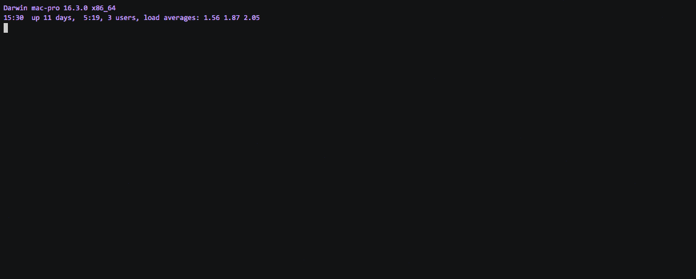

&nbsp;&nbsp;&nbsp;&nbsp;在github上浏览项目的时候，看到 How to use it 是个录屏播放的动画，我觉得很炫酷，调研了下，其实他就是用asciinema这个工具生成的。它的项目地址是:
```url
https://github.com/asciinema
```
mac直接可以通过brew 来安装。
```shell
brew install asciinema
```
centos使用yum安装
```shell
yum install -y asciinema
```
这样就安装好了客户端了。一下是这个软件的使用方法:
```shell
jukay@mac-pro ~/C/W/blog> asciinema -h                                                                                                        367ms  五  5/11 15:23:45 2018
usage: asciinema [-h] [--version] {rec,play,cat,upload,auth} ...

Record and share your terminal sessions, the right way.

positional arguments:
  {rec,play,cat,upload,auth}
    rec                 Record terminal session
    play                Replay terminal session
    cat                 Print full output of terminal session
    upload              Upload locally saved terminal session to asciinema.org
    auth                Manage recordings on asciinema.org account

optional arguments:
  -h, --help            show this help message and exit
  --version             show program's version number and exit

example usage:
  Record terminal and upload it to asciinema.org:
    asciinema rec
  Record terminal to local file:
    asciinema rec demo.cast
  Record terminal and upload it to asciinema.org, specifying title:
    asciinema rec -t "My git tutorial"
  Record terminal to local file, limiting idle time to max 2.5 sec:
    asciinema rec -i 2.5 demo.cast
  Replay terminal recording from local file:
    asciinema play demo.cast
  Replay terminal recording hosted on asciinema.org:
    asciinema play https://asciinema.org/a/difqlgx86ym6emrmd8u62yqu8
  Print full output of recorded session:
    asciinema cat demo.cast

For help on a specific command run:
  asciinema <command> -h
```
可以将命令行录制成文件文件保存起来，默认是会上传到服务器，这个服务器是默认是asciinema的官网，上传成功后，会输出对应的访问路径。如果你想保存在自己的服务器上，那么你可以安装  [asciinema server](https://github.com/asciinema/asciinema-server),通过命令行参数指定你自己的asciinema server的地址:
```shell
ASCIINEMA_API_URL=https://your.asciinema.host asciinema rec
```
当然，我们也可以按 ctrl C 来使录制过程保存在本地，一般会保存在当前系统的/tmp文件夹中的一个随机文件，如果你需要，可以指定文件的目录和名字。录制好了的文件当然也可用asciinema来进行播放。
```shell
asciinema rec myoperation.cast
```
这条命令执行文件以后就会进如录制阶段，如果要结束录制，直接输入
```shell
exit
```
我们来试一下吧:

我们的操作过程就被录制下来了，那么问题来了：这个gif是怎么生成的呢。详情请参考如下项目:
```shell
https://github.com/asciinema/asciicast2gif
```
