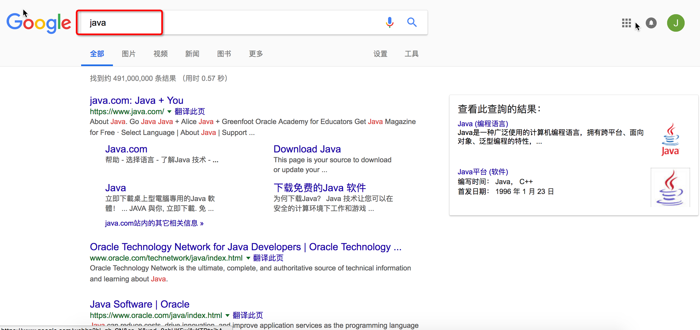
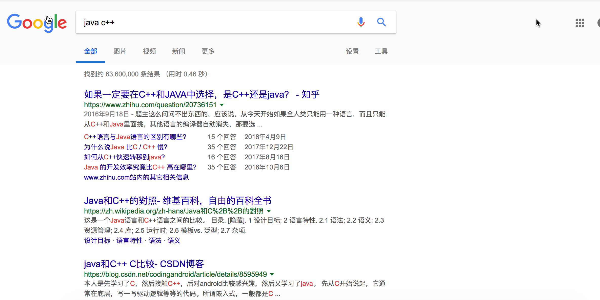
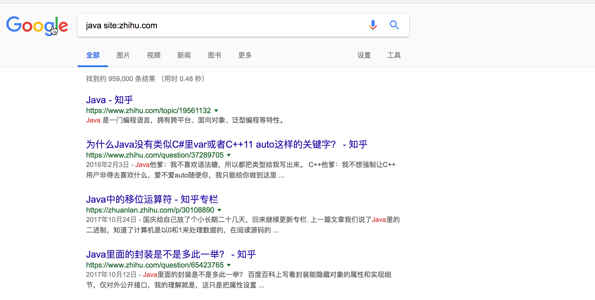
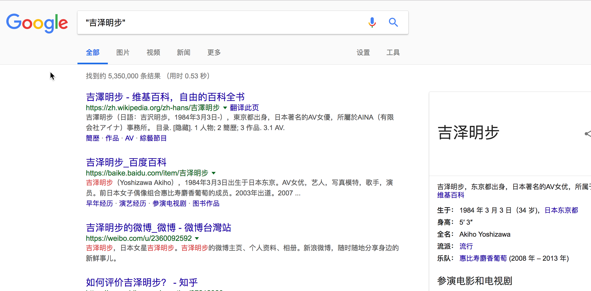
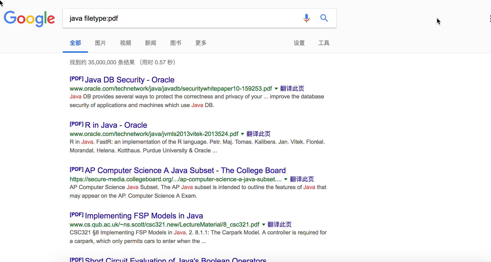
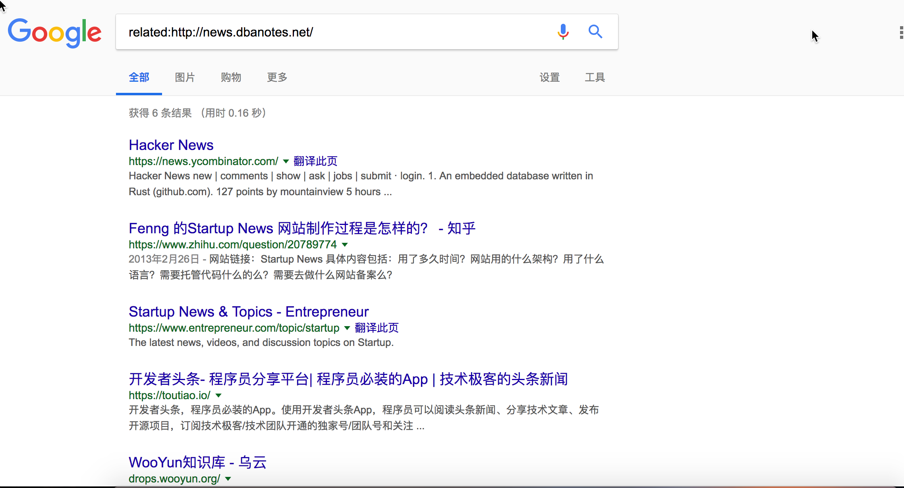

虽然标题写的是google搜索，但是大部分的技巧在baidu下也是适用的，本文中的搜索技巧配置chrome的tab补全搜索体验更佳。备注：以下搜索技巧可以混合使用。

## 搜索相关的内容

关联多个内容的时候搜索方式

## 过滤搜索网站结果
你可能注意到了，搜索的第一条结果就是java.com这样网站，如果我想搜索结果里面去掉某个特定网站的内容，比如我在搜索的时候就经常会去掉csnd和cnblog这两个网站。

这样oracle.com和java.com就不会出现在我的搜索结果中了。
## 特定网址网址搜索
有些时候，某些网站的站内搜索功能并不好用，我们可以使用google的站内搜索功能，比如我要在zhihu上搜索java相关的内容。

这样的搜索结果就都是知乎的内容了。
## 关键字搜索
使用英文的双引号把关键字包含起来,这样搜索结果中是必须包含所有关键字的，关键字可以是多个比如:  
1. "a" "b" 既包含字符串a又包含字符串b  
2. "a" -"b" 之包含a字符串，绝对不包含b字符串  
3. "a" or "b" 包含字符串a或者包含字符串b  

## 按照文件类型搜索
使用filtype指令加上文件类型，这个搜索功能有你想要的效果，至于怎么使用，哈哈哈哈哈

## 搜索类似网站
这里搜索出类hacknews相关的网址。

以上就是最常用的google搜索技巧，如果你想知道更多关于google搜索技巧的只是，你可以使用google搜索。

## 参考文章
* [十大高明的Google搜索技巧](http://www.williamlong.info/archives/728.html)

