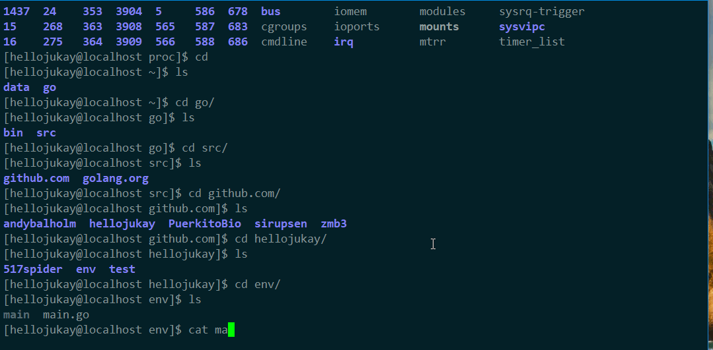

我们的代码如下：
```go
package main

import "fmt"
import "os"
import "time"

func main() {
	for {
		var name = os.Getenv("name")
		time.Sleep(time.Duration(2) * time.Second)
		fmt.Println(name)
	}
}

```
通过内核提供的`/proc`文件来看程序运行中一些状态数据。


这里我们很清楚的看到了name=hellojukay，非常的遗憾的是environ这个文件是无法写入的 `sudo chmod +w environ`也不行。