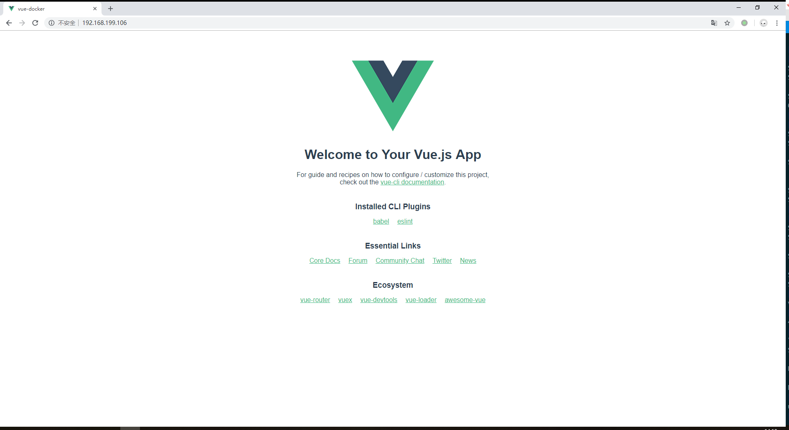
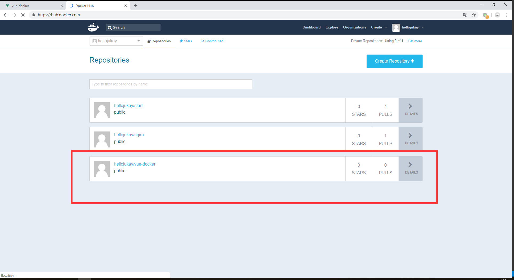

这篇文章将会演示前端容器化的过程，将一个vue项目部署再`docker`容器中。

# 创建vue项目
使用`vue`的cli工具来创建项目
```shell
vue create vue-docker
```
```shell
[hellojukay@localhost vue-docker]$ ls -al
总用量 480
drwxrwxr-x.   7 hellojukay hellojukay    196 10月 27 13:54 .
drwxrwxr-x.   3 hellojukay hellojukay     24 10月 27 13:48 ..
-rw-rw-r--.   1 hellojukay hellojukay     53 10月 27 13:48 babel.config.js
drwxrwxr-x.   5 hellojukay hellojukay     75 10月 27 13:53 dist
drwxrwxr-x.   8 hellojukay hellojukay    166 10月 27 13:49 .git
-rw-rw-r--.   1 hellojukay hellojukay    214 10月 27 13:48 .gitignore
drwxrwxr-x. 803 hellojukay hellojukay  24576 10月 27 13:50 node_modules
-rw-rw-r--.   1 hellojukay hellojukay    811 10月 27 13:48 package.json
-rw-rw-r--.   1 hellojukay hellojukay 429373 10月 27 13:49 package-lock.json
drwxrwxr-x.   2 hellojukay hellojukay     43 10月 27 13:48 public
-rw-rw-r--.   1 hellojukay hellojukay    272 10月 27 13:49 README.md
drwxrwxr-x.   4 hellojukay hellojukay     68 10月 27 13:48 src
```
# 创建Dockerfile
在项目的更目录下创建Dockerfile
```Dockerfile
FROM nginx:latest
COPY . /usr/share/nginx/html/


```

内容也比较简单，将编译好的dist文件夹中静态文件拷贝到nginx的静态文件目录。
# 编译镜像
为了加速编译镜像的过程，使用dist文件夹作为编译的`build context`。
```shell
docker build -f Dockerfile -t vue-docker dist
```
这样的方式，编译速度非常快。
# 启动容器
```shell
docker run -itd --name vue -p 80:80 vue-docker
```
将80端口暴露出来。

# 发布镜像
首先登陆`DockerHub`
```shell
[hellojukay@localhost vue-docker]$ docker login
Login with your Docker ID to push and pull images from Docker Hub. If you don't have a Docker ID, head over to https://hub.docker.com to create one.
Username: hellojukay
Password: 
WARNING! Your password will be stored unencrypted in /home/hellojukay/.docker/config.json.
Configure a credential helper to remove this warning. See
https://docs.docker.com/engine/reference/commandline/login/#credentials-store

Login Succeeded

```
登陆成功以后，`docker push`发布镜像到`DockerHub`,重名了一下镜像` docker tag vue-docker hellojukay/vue-docker:v0.01`。
```shell
[hellojukay@localhost vue-docker]$ docker push hellojukay/vue-docker
The push refers to repository [docker.io/hellojukay/vue-docker]
116c4e0135af: Pushed 
86df2a1b653b: Pushed 
bc5b41ec0cfa: Pushed 
237472299760: Pushed 
v0.01: digest: sha256:fc62a20b645718277b6200ca1627bafbeff37016ac26956da59b1511f52c4833 size: 1158
```

