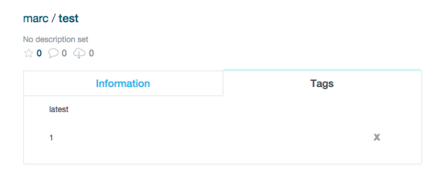

`docker`有一个名字叫做`latest`的tag，某些时候，他的工作方式可能是你想象的不一样。我也听到了很多再误解的宣传这个tag的作用。因为镜像的tag在部署的时候会经常用到，所以你必须理解tag的工作方式。

# 实验
为了能够说明问题，我们创建一个非常简单的`Dockerfile`文件
```Dockerfile
FROM busybox:ubuntu-14.04
RUN echo “#!/bin/sh\n” > /test.sh
RUN echo “echo \”this is version 1\”” >> /test.sh
ENTRYPOINT [“sh”, “/test.sh”]
```
为了保持简单，我们只是用一个简单的shell脚本，他输出当前的镜像版本。我们编译这个镜像
```shell
sudo docker build -t marc/test .
```
我们运行他
```shell
sudo docker run marc/test
this is version 1
```
输出符合预期。接下来，我们给这个镜像打上tag
```shell
sudo docker tag marc/test marc/test:1
```
现在我们将这个镜像推送到`DockerHub`上
```shell
sudo docker push marc/test 
```
推送成功，现在看下`DockerHub`上展示的图像


我们现在再编辑一下`Dockerfile`,这是第二个版本
```Dockerfile
FROM busybox:ubuntu-14.04
RUN echo “#!/bin/sh\n” > /test.sh
RUN echo “echo \”this is version 2\”” >> /test.sh
ENTRYPOINT [“sh”, “/test.sh”]
```
重复之前的过程，我们构建这个镜像，并且将它推送到`DockerHub`上
```shell
$sudo docker build -t marc/test:2
sudo docker push marc/test
```
现在我们云这个镜像
```shell
$ sudo docker run marc/test 
this is version 1
```
很吃惊，结果并不是我们想想的那样子，他输出了版本1。我们在此从`DockerHub`上获取镜像
```shell
$sudo docker pull macr/test
$sudo docker run marc/test
this is version 1
```
还是输出了版本1.

我们再推送了第一个版本以后，我们有推送了第二个版本，这里发送了什么，`latest`的tag不是最新版本。

# 说明
`latest`只是一个特殊名字的tag,并不表示最新的镜像。除非你再编译镜像的时候指定了镜像的tag，否则默认就是latest的tag。所以说再生产环境，不要使用`latest`来作为新版本。所以再每次构建的时候，你应该使用一个明确的版本号来表示当前镜像版本。