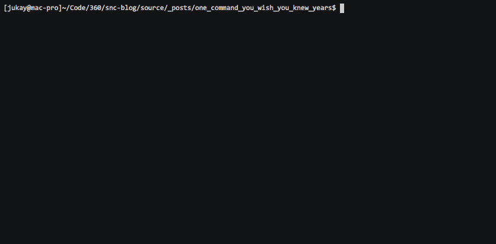

在reddit上看到一个热门帖子，内容是：一人给一个你相见恨晚的Linux命令。

```shell
disown
```
> 这是一个bash内置命令，如果你需要将当前程序在后台运行的时候，有两个方式，1.让当前程序在新的session中运行。2.程序内部处理SIGUP信号，nohup就只这种工作方式。disown这个命令也能达到相同的功能。更多内容参考: https://www.ibm.com/developerworks/cn/linux/l-cn-nohup/


```shell
touch log
gdb -p 22499
(gdb) p close(1) # This closes the stdout of the running process
(gdb) p open("/home/.../log", 1) # This will open the log-file with O_WRITE
(gdb) c
```
> 这是一种非常hack的方式来将一个已经正在运行的程序的标准输出重定向到文件。更多内容参考: https://github.com/nelhage/reptyr

```shell
cat ~/.ssh/id_dsa.pub | ssh me@remotebox "cat >> ~/.ssh/authorized_keys"
```
> 通过ssh连接跨机器使用管道符,这也是比较hack的一种方式。顺便说一句，scp也是使用的ssh协议，所以在使用scp的时候，如果你配置了秘钥，那么scp是可以使用tab键来进行补全提示的。


```shell
fc
```
> fc命令能够将上一次执行的命令在编辑器中打开,这个默认的编辑器可以使EDITOR环境变量来设置。


```shell
lsof
```
> lsof能够列出当前操作系统打开的所有文件描述符，包括socket,文件等等,与之类似还有一个`fuser`命令。

```shell
CTRL + L 
```
> 这是一个快捷键，和clear的功能一样能够快速清空当前的terminal,bash还有很多快捷键，请参考： https://blog.hellojukay.cn/2018/05/23/20180523/。

```shell
man ascii
```
> 在mac上下能够按照是十六进制的方式处处ascii码表，很多从事嵌入式开发的程序使用这个小技巧，同样的`ascii -x`也能实现这个功能.

```shell
xargs
```
> 能够将上一个程序的标准输出传给下一个程序的命令行，我最喜欢的功能是:`echo xx | xargs -I {} command {}`。

```shell
convert
```
> convert命令能够进行图片格式转换。


```shell
^find^replace
```
> 这是一个比较冷门的用法，通常在你出入命令行错误，或者你在用另一个参数再次运行某个命令，用这种凡是来修改命令行，类似的哈有`!:s/find/replace`以及全局替换`!:gs/find/replace`。




```shell
rsync
```
> 这是一个同步，备份文件的命令。

```shell
iftop
```
> 这是一个监控网卡流量的命令，类似的监控io情况的命令有：iotop 。

```shell
sudo !!
```
> 使用sudo权限来执行上一条命令,换句话说，如果只是单纯的再次执行上一条命令就用`!!`即可。我习惯使用`CTRL + P`然后`CTRL + a`,然后输入sudo。

```shell
cd -
```
> 这条命令能够将你待会上一次所在目录。关于目录跳转的还有另外一个很有意思的工具: https://github.com/wting/autojump

```shell
tail -f file
```
> 能够监控文件的变化，实时输出到标准输出。

```shell
:w! sudo tee %
```
> 这是一条vim的内置命令，当你用普通用户编辑文件，但是没有权限保存的时候，这个条命令能够让你用sudo权限保存当前文件。


```shell
python -m SimleHTTPServe 8080
```
> 启动一个简单的http目录，暴露8080端口，将当前目录下的文件暴露出去。这是正对于python2版本，如果是python3环境，则使用`python -m http.server 8080`。


```shell
fmt
```
> 文件格式化编排后输出到标准输出。

```shell
pkill/pgrep
```
> 按照名字查找进程号，类似`ps aux | grep name| awk '{print $2}'`。

```shell
pv
```
> 以进度条的方式显示命令行的执行进度。

```shell
pushd/popd
```
> 这是是用堆栈的方式来进行目录跳转`pushd`跳转到目录目录，并将当前目录放在栈定，`pop`移除栈顶元素，回到上一次目录。


```shell
ncdu
```
> 查看磁盘空间占用情况。


```shell
dmidecode
```
> 或者当前系统的硬件信息。


```shell
htop
```
> 与top命令的功能类似，但是显示界面更加友好。


```shell
strace
```
> 这是非常hack的一个命令，能够调试一个脚本.


```shell
vnstat
```
> 一款linux下的性能监控工具。


```shell
find . -exec
```
> 查找可执行文件。


```shell
tree
```
> 展示当前目录的树状结构。


```shell
pstree
```
> 显示一个正在运行中的程序的进程树状结构。


```shell
ss
```
> ss 也就是 socket status ,用来展示socket讯通状态的命令，类似于 netstat 命令 。


```shell
sl
```
> sl这是一个非常滑稽的命令，如果你想深入ls,但是不小心写错了，终端中会有一个小火车驶过。


原文链接: [https://www.reddit.com/r/linux/comments/mi80x/give_me_that_one_command_you_wish_you_knew_years/](https://www.reddit.com/r/linux/comments/mi80x/give_me_that_one_command_you_wish_you_knew_years/)