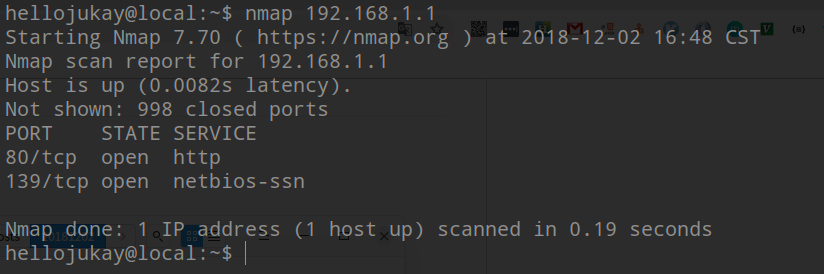
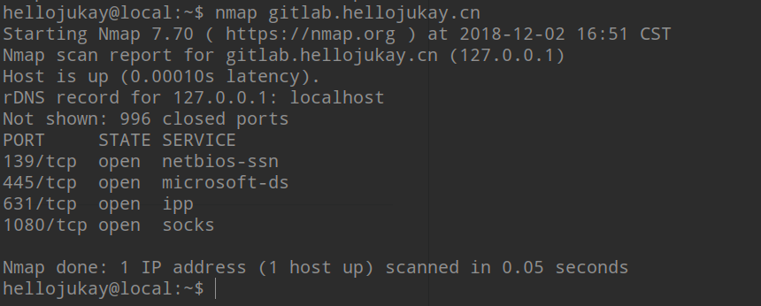
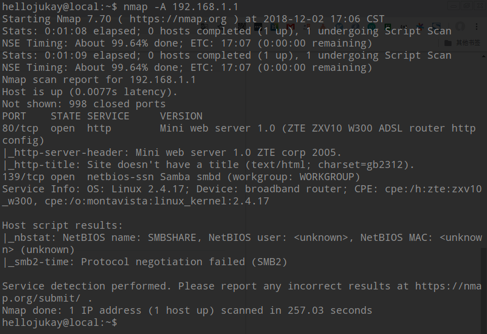

nmap是一个开源的网络扫描工具，在网络方便使用较多。然后nmap的命令行用法对于初学者来说非常不友好，这篇文件将会介绍基本的nmap命令，不会面面俱到，只希望你对nmap有一个基本的了解，不在惧怕nmap命令。

# nmap能做什么？
nmap使用IP包的方式发送数据，他能找到局域网内有那些机器在运行那些服务，他们分别是什么操作系统，端口是否开放，机器启动时间等等。

一下问题，使用nmap能够轻易的解决。
* 局域网内有那些机器在运行
* 局域网内有那些IP地址
* 某个IP所指向的机器运行着什么操作系统
* 你能扫描目标机器上有那些端口开放着
* 了解目标机器是否感染了病毒
* 搜索当前网络中有那些未认证的网络服务
* 查找安全级别较低的机器


# 如何安装nmap呢？
如果你是debian操作系统
```shell
sudo apt install nmap
```
参考文章：
* [https://www.cyberciti.biz/faq/install-nmap-debian-ubuntu-server-desktop-system/](https://www.cyberciti.biz/faq/install-nmap-debian-ubuntu-server-desktop-system/)
* [https://www.cyberciti.biz/faq/howto-install-nmap-on-centos-rhel-redhat-enterprise-linux/](https://www.cyberciti.biz/faq/howto-install-nmap-on-centos-rhel-redhat-enterprise-linux/)
* [https://www.cyberciti.biz/faq/installing-nmap-network-port-scanner-under-openbsd-using-pkg_add/](https://www.cyberciti.biz/faq/installing-nmap-network-port-scanner-under-openbsd-using-pkg_add/)

# 扫描单个目标
```shell
# 扫描单个目标机器
nmap 192.168.1.1
```

```shell
# 扫描单个域名
nmap gitlab.hellojukay.cn
```


## 扫描多个目标或者是子网
```shell
nmap 192.168.1.1 182.168.1.2
```
```shell
nmap 192.168.1.1,2,3
```
你也可以扫描某个范围内的IP地址
```shell
nmap 192.168.1.1-20
```
你也可以使用通配符
```shell
nmap 192.168.1.*
```
你也可以扫描整个子网
```shell
nmap 192.168.1.0/24
```

# 从文件中读取扫描目标
使用`-iL`选项来读取你需要扫描的目标机器列表，这通常使用来扫描一大批机器，文件编写语法如下：
```bash
gitlab.hellojukay.cn
192.168.1.1
192.168.1.0/24
localhost
```
命令行语法：
```shell
nmap -iL hosts.txt
```

# 过滤目标
当你扫描一大批机器的时候，你想过滤掉某个目标，不进行网络扫描，你可以使用`--exlude`选项来跳过目标
```shell
nmap 192.168.1.0/24 --exclude 192.168.1.5
nmap 192.168.1.0/24 --exclude 192.168.1.5 192.168.1.6
```

# 扫描机器的系统和网络版本信息
```shell
nmap -A 192.168.1.254
nmap -v -A 192.168.1.1
nmap -A -iL /tmp/scanlist.txt 
```


# 找出防火墙后面的机器
```shell
nmap -sA 192.168.1.254
nmap -sA server1.cyberciti.biz
```

# 启动ipv6网络扫描
使用`-6`选项即可
```shell
nmap -6 IPv6-Address-Here
nmap -6 server1.cyberciti.biz
nmap -6 2607:f0d0:1002:51::4
nmap -v A -6 2607:f0d0:1002:51::4
```
# 扫描网段，查看有那些设备在运行
```shell
nmap -sP 192.168.1.0/24
```
输出如下:
```shell
Host 192.168.1.1 is up (0.00035s latency).
MAC Address: BC:AE:C5:C3:16:93 (Unknown)
Host 192.168.1.2 is up (0.0038s latency).
MAC Address: 74:44:01:40:57:FB (Unknown)
Host 192.168.1.5 is up.
Host nas03 (192.168.1.12) is up (0.0091s latency).
MAC Address: 00:11:32:11:15:FC (Synology Incorporated)
Nmap done: 256 IP addresses (4 hosts up) scanned in 2.80 second
```
# 快速扫描
```shell
nmap -F 192.168.1.1
```

# 仅展示开放的端口
```shell
nmap --open 192.168.1.1
nmap --open server1.cyberciti.biz
```

# 扫描指定端口
nmap -p [port] hostName
```shell
## Scan port 80
nmap -p 80 192.168.1.1
```
扫描TCP的80端口
```shell
nmap -p T:80 192.168.1.1
```
扫描UDP的53端口
```shell
nmap -p U:53 192.168.1.1
```
扫描两个端口
```shell
nmap -p 80,443 192.168.1.1
```
扫描特定范围的端口
```shell
nmap -p 80-200 192.168.1.1
```
使用通配符扫描所搜端口
```shell
nmap -p "*" 192.168.1.1
```
扫描常用的端口
```shell
nmap --top-ports 5 192.168.1.1
nmap --top-ports 10 192.168.1.1
```
输出如下:
```shell
Starting Nmap 5.00 ( http://nmap.org ) at 2012-11-27 01:23 IST
Interesting ports on 192.168.1.1:
PORT     STATE  SERVICE
21/tcp   closed ftp
22/tcp   open   ssh
23/tcp   closed telnet
25/tcp   closed smtp
80/tcp   open   http
110/tcp  closed pop3
139/tcp  closed netbios-ssn
443/tcp  closed https
445/tcp  closed microsoft-ds
3389/tcp closed ms-term-serv
MAC Address: BC:AE:C5:C3:16:93 (Unknown)

Nmap done: 1 IP address (1 host up) scanned in 0.51 seconds
```


原文地址: [https://www.cyberciti.biz/security/nmap-command-examples-tutorials/amp/?__twitter_impression=true](https://www.cyberciti.biz/security/nmap-command-examples-tutorials/amp/?__twitter_impression=true)
