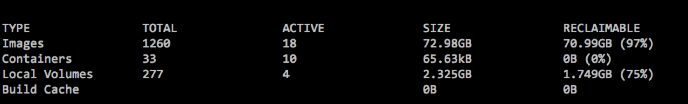

线上编译卡主了，卡在执行`docker rmi {image}:{tag}`的地方，我知道执行`docker images`会很卡，但是没有想到删除镜像也会卡主。我的猜测是镜像太多的原因，所以我想删除一部分到的镜像，但是当我执行 `docker rmi $(docker images -aq)`还是很卡。执行了一下`docker system df`

果然，镜像存储已经快要占用了满了。

所以我想暴力解决问题，直接删除`/var/lib/docker`文件夹，因为所有的镜像和卷都是存储在这个文件夹中了。`systemctl stop docker`先关闭docker进程，然后删除文件夹，但是提示我文件夹被占用，其实是没有被占用的。所以我重启了机器`reboot`，让后再关闭docker,删除`/var/lib/docker`。大功告成.

## 2018年12月30日更新
`/var/lib/docker`这个目录是docker的工作目录，里面存储了镜像，网络，volume，容器。所以说，如果删除这个文件，那么以上所有东西都会被删除, 当然登录仓库的信息也会被删除，也就是说你需要重新登录一次仓库.
