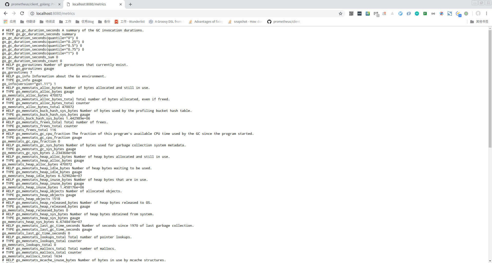
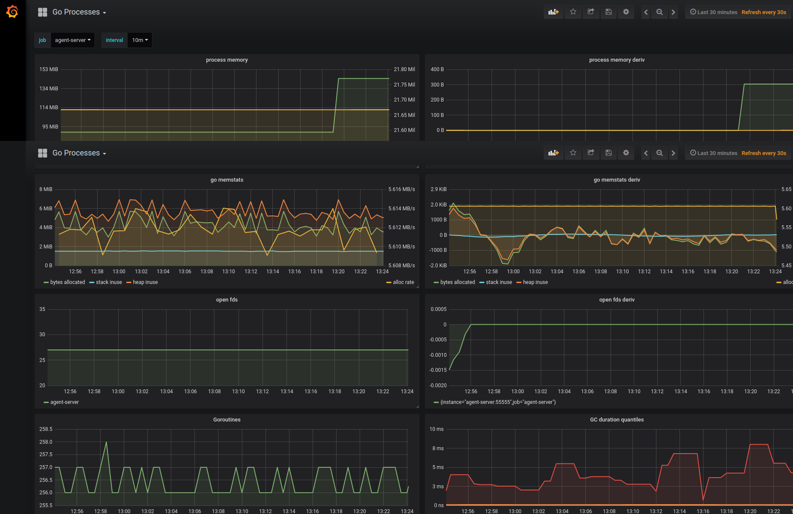

prometheus是一个非常棒的工具，结合grafana能够让我在不写代码，或者少写代码的情况下搭建一套有效的监控体系。这里介绍一下prometheus监控golang程序的方式。

要想你的程序能够被监控，你就必须要将程序运行中的各项目指标暴露出来，提供给promtheus采集信息。我们可以使用promethues提供的[golang客户端](https://github.com/prometheus/client_golang)暴露自身的运行时信息。代码例子如下:
```golang
package main

import (
	"log"
	"net/http"

	"github.com/prometheus/client_golang/prometheus/promhttp"
)

func main() {
	http.Handle("/metrics", promhttp.Handler())
	log.Fatal(http.ListenAndServe(":8080", nil))
}
```
```shell
go run main.go
```
访问本地的8080端口就能看到监控的指标,这里监控的都是默认指标，当然你可以可以自定义你需要的量化的指标，然后暴露出来，具体做法我不介绍了。

现在我们要配置promtheus，让他采集我们的监控指标
```txt
  - job_name: 'golang'
    scrape_interval: 20s
    metrics_path: /metrics
    static_configs:
      - targets: ['localhost:8080']
```
启动promethues，我们golang指标就被采集到了时序数据库中，接下来就是把这些指标在grafana图形化展示出来，最后展示出来的效果如下:

如果服务数量较多，可以考虑将服务注册到consul中去，promethues通过服务发现来采集需要监控的服务。
