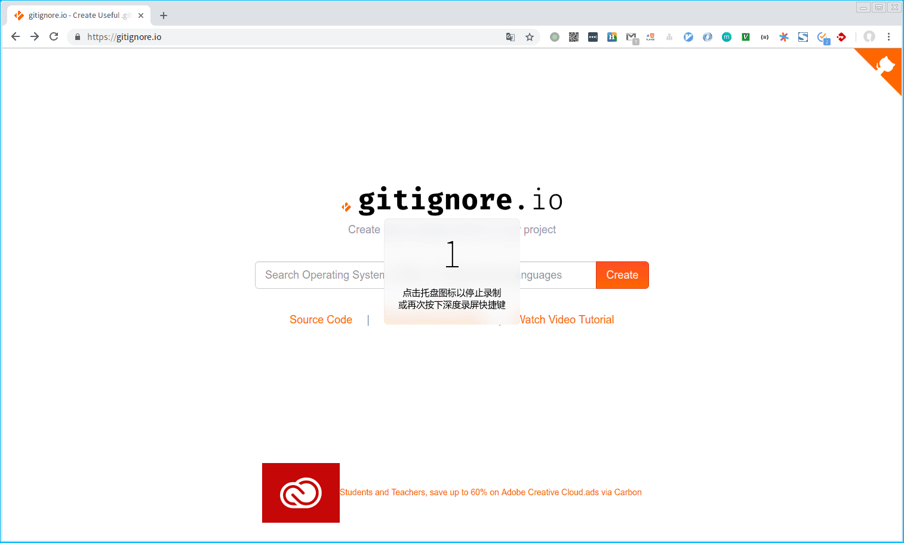
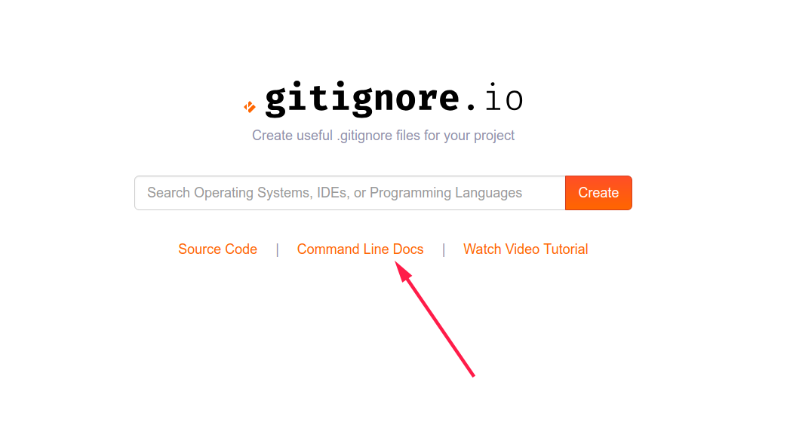

看到大家提交代码都比较随意，把一些本地的工程文件都提交到了git仓库中，这样会带来一个坏处，别的同事pull了你的代码，以后发现在自己本地环境跑不起来，因为工程文件中定义了一些工程路径，二进制包路径之类的配置。

# 在线生成
自己手写gitignore比较麻烦，我找了一个能自动生成`gitignore`文件的方式，[https://gitignore.io/](https://gitignore.io/)这个网站只有输入相关信息就能生成对于的.gitignore文件，基于上述文件，大部分情况下默认生成配置就够了。有特殊需求，再自己手动修改一下。

在本地工程目录的根目录下创建`.gitignore`文件，将上述生成配置拷贝进去即可。
```shell
touch .gitignore
```

# 命令行方式
<font color=red>我是一个用惯了命令行界面的大佬，这种图形界面的东西我根本就看不上。看下这里</font>


选用一种你看得上眼的命令行方式，我选择`bash`
```shell
echo "function gi() { curl -sL https://www.gitignore.io/api/\$@ ;}" >> \
~/.bashrc && source ~/.bashrc
```
作为大佬的你，可能早已经从上面的url中发现了你中猫腻。

使用方式`gi + 任意关键字,逗号隔开`,我使用Pycharm来编写python代码
```shell
gi python,pycharm >> .gitignore
```
我使用vscode来编写golang代码
```shell
gi go,visualstudiocode
```


慢慢玩吧。
# 相关项目
* [https://www.gitignore.io](https://www.gitignore.io)
* [https://github.com/github/gitignore](https://github.com/github/gitignore)
* [https://github.com/karan/joe](https://github.com/karan/joe)
