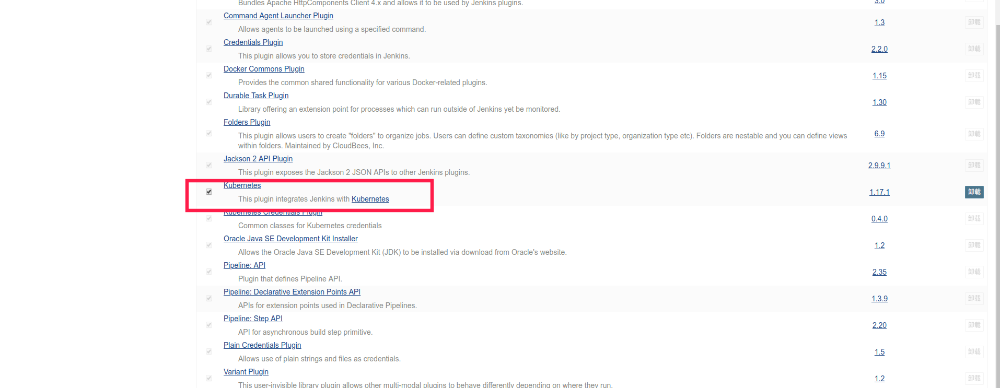
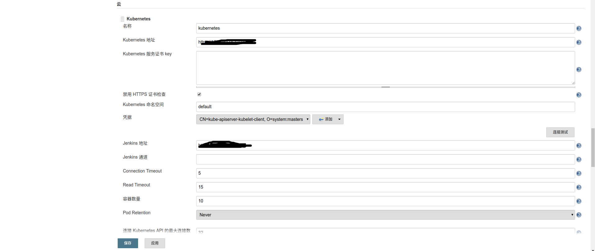
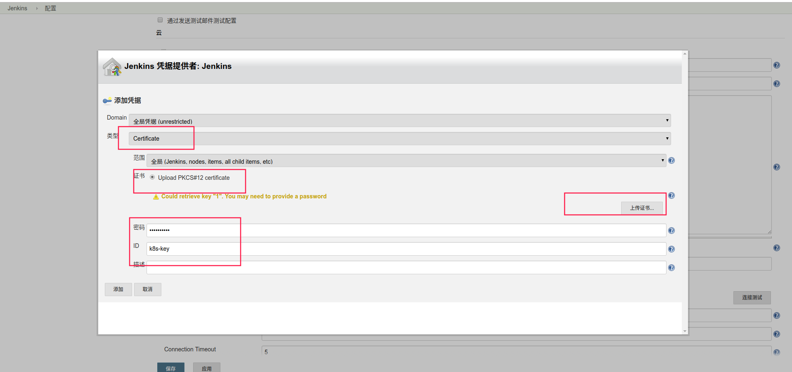
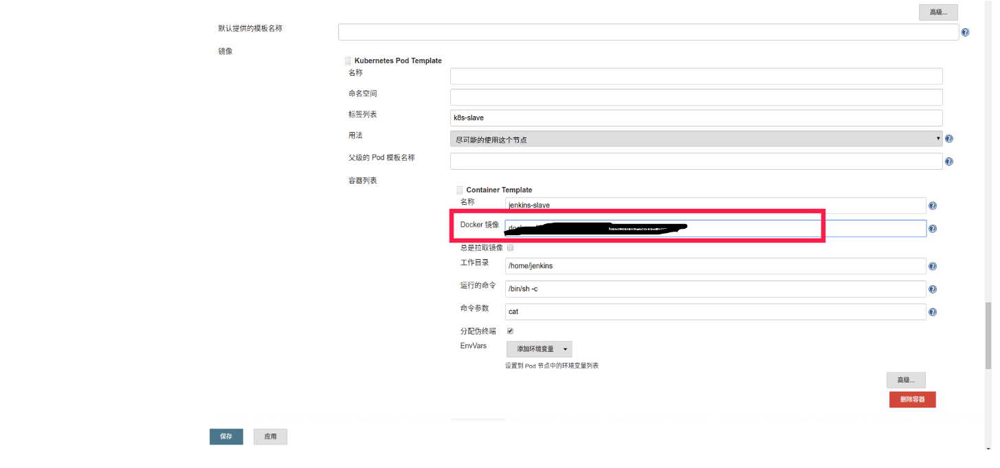

第一步：在 jenkins 上安装 k8s 插件

第二步: 在 jenkins 上配置 k8s 插件，在系统设置中添加"云"

第三步: 第二部中需要添加凭证信息，制作方式如下：
```shell
[licong@k8s01v pki]$ pwd
/etc/kubernetes/pki
[licong@k8s01v pki]$ ls -al
总用量 60
drwxr-xr-x 3 root root 4096 7月  17 13:55 .
drwxr-xr-x 4 root root  125 7月  17 13:56 ..
-rw-r--r-- 1 root root 1249 7月  17 13:55 apiserver.crt
-rw-r--r-- 1 root root 1090 7月  17 13:55 apiserver-etcd-client.crt
-rw------- 1 root root 1675 7月  17 13:55 apiserver-etcd-client.key
-rw------- 1 root root 1679 7月  17 13:55 apiserver.key
-rw-r--r-- 1 root root 1099 7月  17 13:55 apiserver-kubelet-client.crt
-rw------- 1 root root 1679 7月  17 13:55 apiserver-kubelet-client.key
-rw-r--r-- 1 root root 1025 7月  17 13:55 ca.crt
-rw------- 1 root root 1675 7月  17 13:55 ca.key
drwxr-xr-x 2 root root  162 7月  17 13:55 etcd
-rw-r--r-- 1 root root 1038 7月  17 13:55 front-proxy-ca.crt
-rw------- 1 root root 1679 7月  17 13:55 front-proxy-ca.key
-rw-r--r-- 1 root root 1058 7月  17 13:55 front-proxy-client.crt
-rw------- 1 root root 1679 7月  17 13:55 front-proxy-client.key
-rw------- 1 root root 1675 7月  17 13:55 sa.key
-rw------- 1 root root  451 7月  17 13:55 sa.pub
```
记住下面命令行输入的命令，会在 jenkins 配置中用到
```shell
[licong@k8s01v pki]$ sudo openssl pkcs12 -export -out cert.pfx -inkey apiserver-kubelet-client.key -in apiserver-kubelet-client.crt   -certfile ca.crt
Enter Export Password:
```


第四步: 配置一个默认模板，也就是大家执行 k8s 构建的时候不指定 pod 时候使用的默认容器


第五步： jenkinsfile 配置,给以简单额配置如下
```yaml
pipeline {
    environment {
        git_cred = "licong-biz"
        image = "docker.hellojukay.cn/server"
    }
  agent {
    kubernetes {
      defaultContainer 'jnlp'
      yaml """
apiVersion: v1
kind: Pod
metadata:
  labels:
    some-label: some-label-value
spec:
  containers:
  - name: gradle
    image: docker.hellojukay.cn/java:8-jdk-alpine
    command:
    - sh
    tty: true
  - name: docker
    image: docker.hellojukay.cn/docker:18.09
    command: ['cat']
    tty: true
    volumeMounts:
    - name: dockersock
      mountPath: /var/run/docker.sock
  volumes:
  - name: dockersock
    hostPath:
      path: /var/run/docker.sock
"""
    }
  }
  stages {
    stage('gradle build') {
      steps {
        sh "mkdir -p sec-matrix-core"
        dir("sec-matrix-core") {
            git branch: "${env.BRANCH_NAME}",credentialsId: "${git_cred}", url: "${env.GIT_URL}"
            container('gradle') {
                sh 'cd backend && ./gradlew build'
            }
            container('docker') {
                sh """
                  ls -al 
                  cd  backend && docker build -t ${image}:${env.BUILD_ID} .
                """
            }
        }
      }
    }
  }
}
```