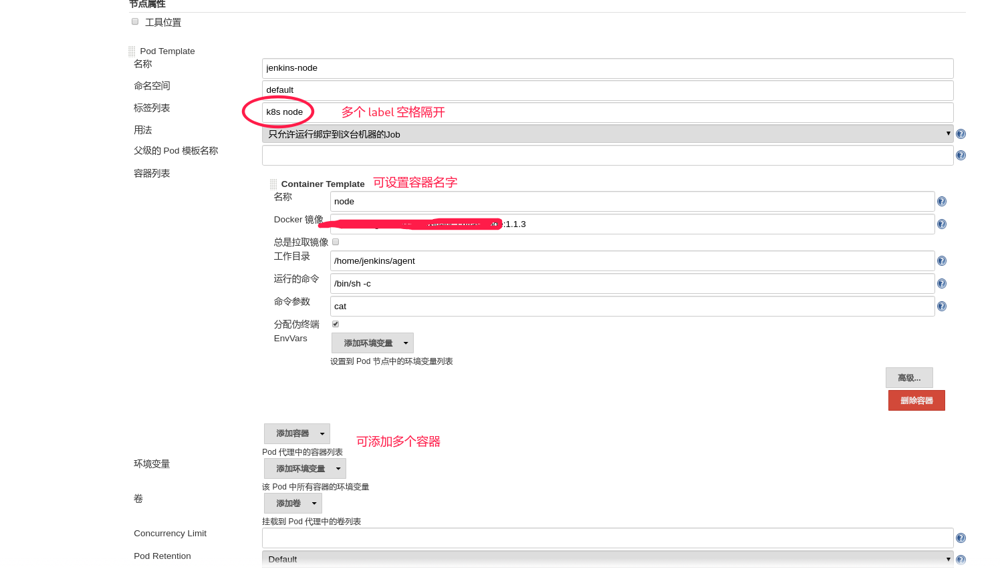

jenkins 结合 k8s 插件能够在 k8s 集群中构建代码，这个非常方便。这里总结一下集中结合 k8s  的用法。

#  界面配置 template
在 jenkins 设置界面配置好 template 

设置好标签以后，就能在 jenkinsfile  中使用这个节点了。如下：
```groovy
pipeline  {
    agent {
        label  "k8s"
    }
    stages {
        stage("test"){
            steps {
                container("node"){
                    echo "Hello World"
                }
            }
        }
    }
}
```
这里使用 k8s 这个 template 来启动构建环境，并且使用容器名字为 node 的容器。

# jenkinsfile 引入template 文件
在项目的其他文件中定义好 k8s 的 pod 文件，然后在 agent 中通过 yamlFile 指令导入进来
```shell
agent {
    kubernetes {
        yamlFile "k8s_pod.yml"
    }
}
```

# jenkinsfile 直接定义 template
```groovy
podTemplate(containers: [
    containerTemplate(name: 'maven', image: 'maven:3.3.9-jdk-8-alpine', ttyEnabled: true, command: 'cat'),
    containerTemplate(name: 'golang', image: 'golang:1.8.0', ttyEnabled: true, command: 'cat')
  ]) {

    node(POD_LABEL) {
        stage('Get a Maven project') {
            git 'https://github.com/jenkinsci/kubernetes-plugin.git'
            container('maven') {
                stage('Build a Maven project') {
                    sh 'mvn -B clean install'
                }
            }
        }

        stage('Get a Golang project') {
            git url: 'https://github.com/hashicorp/terraform.git'
            container('golang') {
                stage('Build a Go project') {
                    sh """
                    mkdir -p /go/src/github.com/hashicorp
                    ln -s `pwd` /go/src/github.com/hashicorp/terraform
                    cd /go/src/github.com/hashicorp/terraform && make core-dev
                    """
                }
            }
        }

    }
}
```
或者这样写
```groovy
podTemplate(yaml: """
apiVersion: v1
kind: Pod
metadata:
  labels:
    some-label: some-label-value
spec:
  containers:
  - name: busybox
    image: busybox
    command:
    - cat
    tty: true
"""
) {
    node(POD_LABEL) {
      container('busybox') {
        sh "hostname"
      }
    }
}
```
或者这样
```groovy
pipeline {
  agent {
    kubernetes {
      yaml """
apiVersion: v1
kind: Pod
metadata:
  labels:
    some-label: some-label-value
spec:
  containers:
  - name: maven
    image: maven:alpine
    command:
    - cat
    tty: true
  - name: busybox
    image: busybox
    command:
    - cat
    tty: true
"""
    }
  }
  stages {
    stage('Run maven') {
      steps {
        container('maven') {
          sh 'mvn -version'
        }
        container('busybox') {
          sh '/bin/busybox'
        }
      }
    }
  }
}
```
