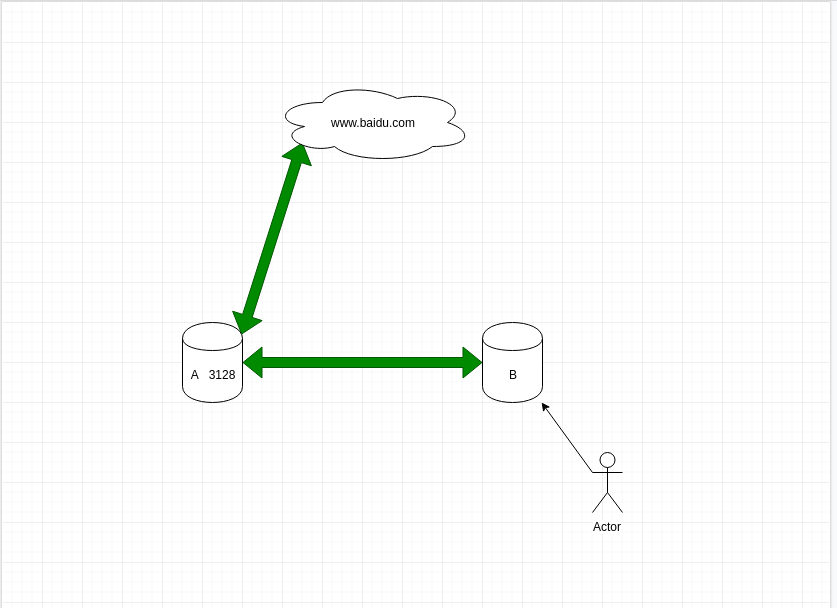

问题：
1. 服务器或者其他机器被 OPS 限制了访问公网的能力。PS: 网络安全部和 OPS 做法是对的。
2. 使用公司的翻墙代理网络会走到国外，访问国内网站反而更加慢
3. 代理以后不设置 no_proxy 无法访问内网。

解决方案：

如果团队拥有能网上的服务器A，和无法上网的服务器B,并且服务器B能够访问服务器A, 这个时候服务器B可以通过代理到服务器A的方式访问网络。

在 A 机器上
```shell
yum install squid -y 
squid
```

在 B 机器上
```shell
# 只作演示，勿设置全局
# xxxx 位服务器 A 的主机名或 IP 或者 域名
export https_proxy=http://xxxx:3128
export http_proxy=http://xxxx:3128
```
