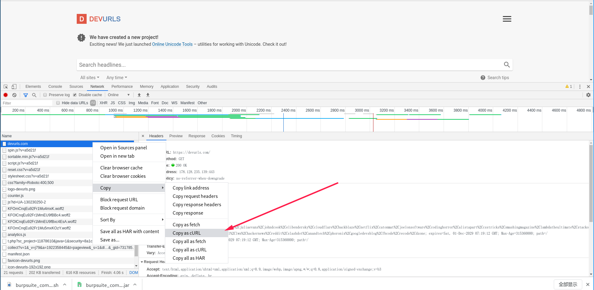
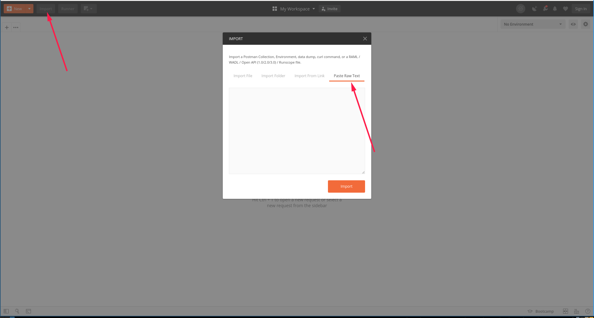
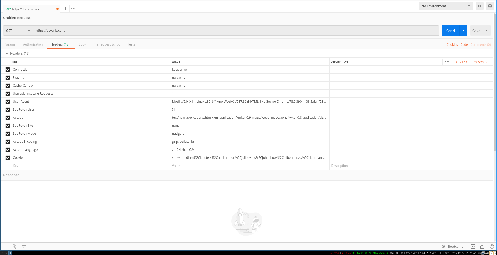
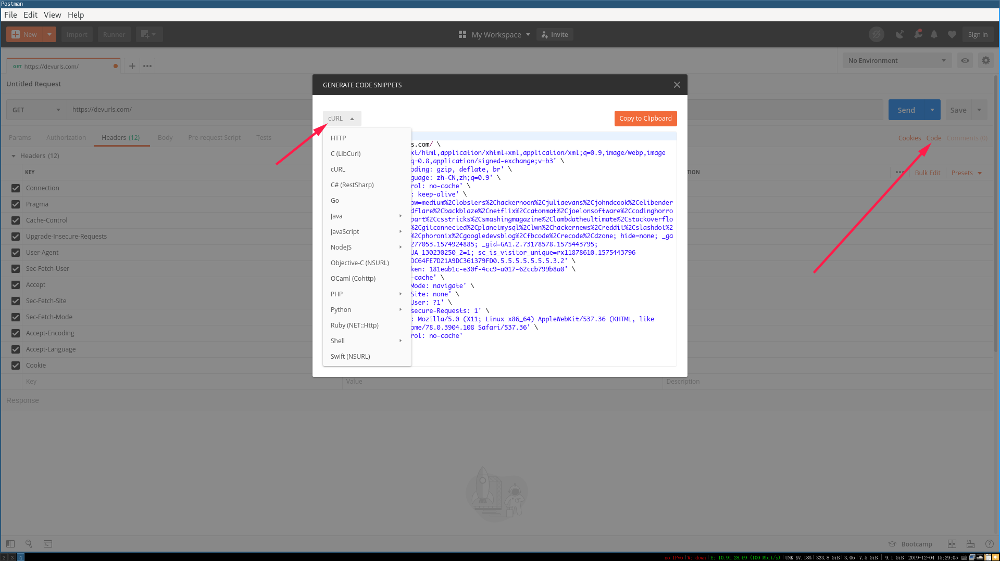

介绍如下使用技巧：

1. 复制浏览器请求到 postman
2. postman 请求生成代码

第一步：复制浏览器请求为文本


第二步：在 postman 导入请求


粘贴请求文本到输入框，可以看到请求参数和请求到被导入成功了


第三步： 导出代码

选择编程语言类型，导出 golang 代码如下：
```golang
package main
 
import (
    "fmt"
    "net/http"
    "io/ioutil"
)
 
func main() {
 
    url := "https://devurls.com/"
 
    req, _ := http.NewRequest("GET", url, nil)
 
    req.Header.Add("Connection", "keep-alive")
    req.Header.Add("Pragma", "no-cache")
    req.Header.Add("Cache-Control", "no-cache")
    req.Header.Add("Upgrade-Insecure-Requests", "1")
    req.Header.Add("User-Agent", "Mozilla/5.0 (X11; Linux x86_64) AppleWebKit/537.36 (KHTML, like Gecko) Chrome/78.0.3904.108 Safari/537.36")
    req.Header.Add("Sec-Fetch-User", "?1")
    req.Header.Add("Accept", "text/html,application/xhtml+xml,application/xml;q=0.9,image/webp,image/apng,*/*;q=0.8,application/signed-exchange;v=b3")
    req.Header.Add("Sec-Fetch-Site", "none")
    req.Header.Add("Sec-Fetch-Mode", "navigate")
    req.Header.Add("Accept-Encoding", "gzip, deflate, br")
    req.Header.Add("Accept-Language", "zh-CN,zh;q=0.9")
    req.Header.Add("Cookie", "show=medium%2Clobsters%2Chackernoon%2Cjuliaevans%2Cjohndcook%2Celibendersky%2Ccloudflare%2Cbackblaze%2Cnetflix%2Ccatonmat%2Cjoelonsoftware%2Ccodinghorror%2Calistapart%2Ccsstricks%2Csmashingmagazine%2Clambdatheultimate%2Cstackoverflow%2Cgithub%2Cgitconnected%2Cplanetmysql%2Clwn%2Chackernews%2Creddit%2Cslashdot%2Canandtech%2Cphoronix%2Cgoogledevsblog%2Cfbcode%2Crecode%2Cdzone; hide=none; _ga=GA1.2.437277053.1574924885; _gid=GA1.2.73178578.1575443795; _gat_gtag_UA_130230250_2=1; sc_is_visitor_unique=rx11878610.1575443796.A30ADAE01DC64FE7D21A9DC361379FD0.5.5.5.5.5.5.5.3.2")
    req.Header.Add("cache-control", "no-cache")
    req.Header.Add("Postman-Token", "fee754e3-f119-4e84-ac30-658d182b091c")
 
    res, _ := http.DefaultClient.Do(req)
 
    defer res.Body.Close()
    body, _ := ioutil.ReadAll(res.Body)
 
    fmt.Println(res)
    fmt.Println(string(body))
 
}
```
